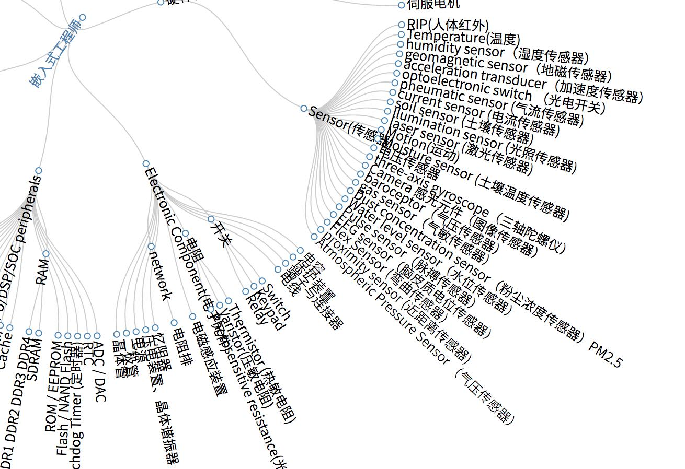

# 快速学习新的框架

今天很流行的 Web 框架，半年以后，可能就会在市场上被『淘汰』——技术选型的时候，不被开发人员推荐；又或者它已经推出了全新的版本，使用了全新的 API，我们便需要更新现有应用。

前端框架丰富多彩的今天，快速学习新的框架，几乎是每个前端程序员的必备技能。

## 快速学习是基本能力

后端程序员，开始一个新的 Web 项目时：

 - 使用 Java 语言，八成会选用 Spring 框架。
 - 使用 Ruby 语言，八成会选用 Rails 框架。
 - 使用 Scala 语言，八成会先用 Play 框架。

而只使用 JavaScript 的前端程序员，开始一个前端项目时。你有几成的把握，能判断他/她出会使用哪个框架？

后端程序员在有限的时间内，只会使用固定的技术栈，固定的框架。对于大部分的公司来说，使用相同的后台语言，是一个更好的选择——即可以减少带成本，又可以沉淀下技术积累。

而前端则不一样，不同的项目都有各自的需求，因此采用使用不同的技术栈。简单的，可以直接使用原生的 JavaScript 完成，又或者是使用 jQuery 完成开发。稍微复杂一点的项目，采用容易上手的 Vue.js 是一个不错的选择。更复杂的项目，便可以使用 Angular，可以方便后台程序员转到前端。

因此，工作一定年限的程序员，都使用过不同的框架。可是，不同的程序员上手新框架的速度，总会存在一定的差异。

那么，怎样才能快速上手一个新的框架呢？

学习新的前端框架，要么该框架很火——即**热闹驱动开发**（Hype Driven Development，HDD），要么你们将采用该框架。在采用新框架的动机里，有一种是：技术演进。使用新的技术、框架，来替换现有的框架。旧的框架在某些地方上，存在着明显的缺陷。

这种情形下，业务知识本身是不变的，只是要由框架本身来应对业务的变化。因此，使用新的技术来替换旧有的框架，就相当的容易——重写，我们甚至可以直接复制、粘贴，大量原有的代码。只是，仅仅做到重写业务逻辑是不够的。我们还要掌握新的框架的核心，并探索更多的可能性。

### 如何学习新框架：守-破-离

对于我而言，学习一个新框架的姿势是：

 - 买本中文书或者找个教程、官方的 Guide，花个十几分钟了解一下框架的『知识图谱』。
 - 直接找个官方的示例，运行一下 Demo。
 - 上手写写应用。
 - 查看官方文档，看看自己是不是漏掉了什么重要的东西。

它与我在公司接受培训的时候，学习到的『守破离』观点相似。

### 守：应用业务知识

在现有的业务上，使用新的框架是一件容易的事。拿上一份框架的说明书、一份需求文档、一个搜索引擎，就可以很容易地复制出一个产品。唯一的门槛是，你需要会读懂这些内容。这有点像新的知识阶级，只是门槛不再是识字与否，而在于是否能懂编程的知识。

正如维基百科上，对于『守』的介绍一样：

> 最初阶段须遵从老师教诲，认真练习基础，达到熟练的境界。

新手期的我们，拿到一个新的框架，要一下子对它了运用自如，是一件很难的事。我们只能在一个又一个的练习中，尝试去掌握框架的知识。

采用一个模板，GitHub 上寻找，这样的项目很多。

举例，如 Backbone + jQuery -> Vue.js

### 破：学习框架核心

> 基础熟练后，试着突破原有规范让自己得到更高层次的进化。

转换技术栈，本身没有什么技术含量，但是能帮助稳固知识。当我们已经熟悉使用这个框架完成业务时，便可以细入相关思想。

了解这个框架的能力，生成一份与框架有关的索引，也可以用脑图的形势来整理这些内容。

如：

举例，如 Angular + TypeScript，还有其他更多的可能性

### 离：探索更多可能性

> 在更高层次得到新的认识并总结，自创新招数另辟出新境界。

在那之上，创造出一些新的框架。

如 Redux，最早是运行的 React.js 之上。Angular 2 出来了后，有了 xx。小程序出来后，有了 xx。

同理于此，

## 小结

寻找心流

这些方法适用于大部分的人，但是不一定适合你。你只需要寻找到适合你的路，然后学习。

