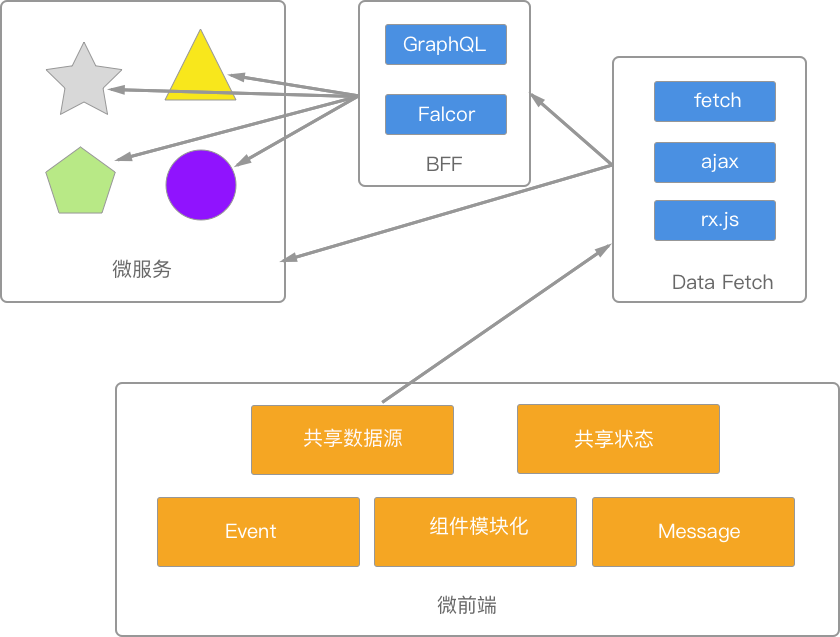

# 前端的趋势

## 微服务与微前端

> 对于后台采用微服务架构来说，在一个不同的组成部分中，使用不同的技术栈是一种不错的体验；而对于一个前端团队来说，在同一个系统的使用不同的技术栈就不是一种不错的体验。

可以使用 Web 存储技术，如 LocalStorage 来转移状态。又或者是诸如 Redux 的方式

## BFF

## 状态管理

Redux

## 跨平台

Angular 可以移动应用和桌面Web应用，可是它并没有像 React 有那么广泛的用途。

React、React VR、React Native

## UI 生成

过去有 DreamWeaver 这样的软件，现在也有一些强大的 UI 工具，可以直接将设计转化为代码。

