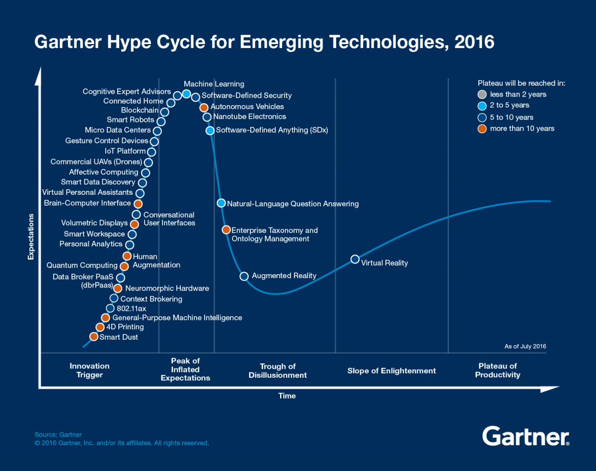

# 转型前端指南

职业转型，放弃你现在的工作、相关行业经验，进入一个“新的环境”。这就意味着，当你想转到前端时，你需要面临一系列的挑战。你的老板并不会关心你的过程是怎样的，只要你能达到当前的能力要求，并有能力适应未来的变化即可。

> 跳槽穷半年，转行穷三年。

在过去的两三年里，随着前端领域的火热，市场上有越来越多的、不同行业的人加入了前端大军。人们出于不同的目的，选择上了前端开发。

有的是，大学里喜欢上前端这个行业，在找工作的时候，便选择了相应的岗位；有的是，不喜欢传统的编译型语言，如电子信息工程；有的是，大学上的专业找不到合适的工作，诸如数学等，并且有些专业与编程相比，拥有同等的逻辑能力要求；有的是，看前端行业很赚钱，便报了个培训班，来到了这个行业。

前端这个职业吧，入门快，上手也简单。简单的网页吧，拉上几个初学者便也能完成。可一旦遇上复杂的前端应用，就会暴露出各种各样的问题。于是，那些原先由非编程领域转行过来的人，便容易招至不满。

究其原因吧，是因为能力上达不到要求。我们到是可以看看，有多少人会转向人工智能，下一个行业热点。

## 改变

一点点慢慢改变，时间长，成本高，但是痛苦小

主要问题：

 - 生活压力
 - 经济来源

 change -> 改变 -> 痛苦

 1. 实验 -> 尝试写代码 -> 意义
 2. 培训或者 workshop
 3. 人脉 <-> 相似的人
 4. 意义 <->

编程世界，比现实世界简单，有严格的对错。

如果你是一个没有编程经验的新手，那么你应该去报一个培训班。他可以在短期内帮你提高技术，但是与之相对应的，会带来一些问题。培训机构出来的学员，都存在一定的简历造假。由于数量众多，质量上参差不齐，导致人们普遍对培训机构出来的学员，存在一定的能力怀疑。说到底，你只能把培训机构当成一个入门，它距离你找到一份工作，还有相当大差距。

但是，你是真心的喜欢编程这个职业吗？

我见过一些后来者，他们在开始的时候问一些愚蠢的问题，慢慢的他们意识到这些问题，都是自己搜索就能解决的。他们会加入一些小组，来提高自己。建立一些信心，并去回答一些别人的问题。

## 后台转前端的挑战

Angular 2 -> 是一个不错的选择

 - 强类型语言 TypeScript
 - 依赖注入等等的设计模式思维

唯一遗憾的是，它不使用 XML 来配置

Node.js 应用也是一个不错的选择

## 其他编程领域转前端

移动端到 React Native，再到 React 

## 其他行业转前端

### 劝退

编程并不是一件容易的事，如果你有业余兴趣便还好，如果没有的话，就算了。

主要原因：它并不是一个赚钱的行业，你是在时间换金钱。。

不妨考虑，投资，或者产生一个千万级的 idea，再找个风投

万一，你又一次选错行了呢？

### 立意已决

首先，打开浏览器、下载 IDE、然后写一行 HTML 试一试

简单的入门书，如 Head First HTML

找一个小的项目

 - 成功的复制一些小网站到本地
 - 然后，再是模拟一些小的项目

1. 不要预期薪水可以达到市场水平。没有人关心你是谁，你只要能干活，并且小公司、外包公司可能是一个更简单的入门。

外包公司 -> 门槛低 -> 相对比较多的成功案例

寻找合作的工作 -> 起步

事实上，按照『技术成熟曲线』理论，前端正在进入低谷期。而人工智能才是，现在，乃至未来一段时间的 IT 高薪领域。

如果你真的喜欢前端，那么：Just do it!

如果你爱请深爱~。

